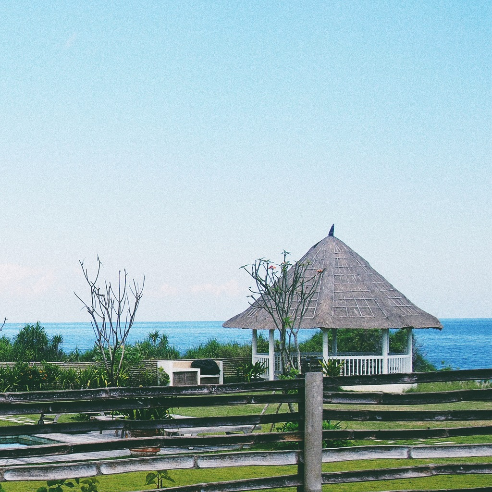
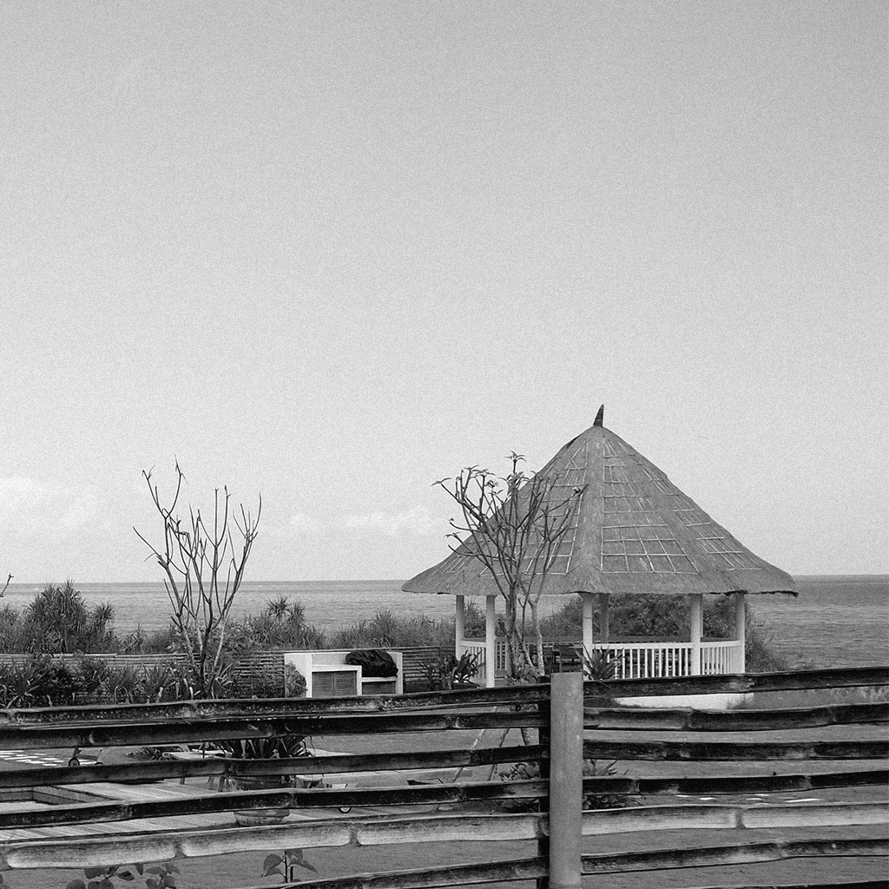
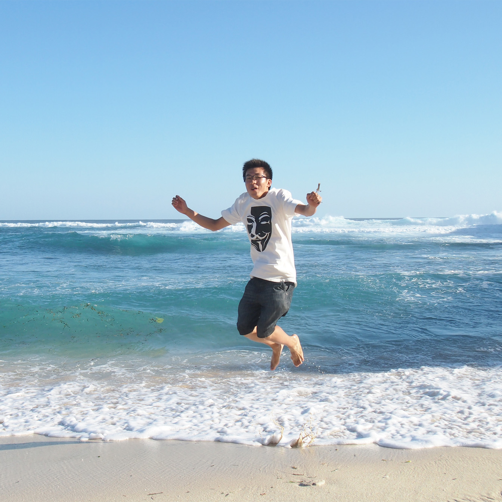
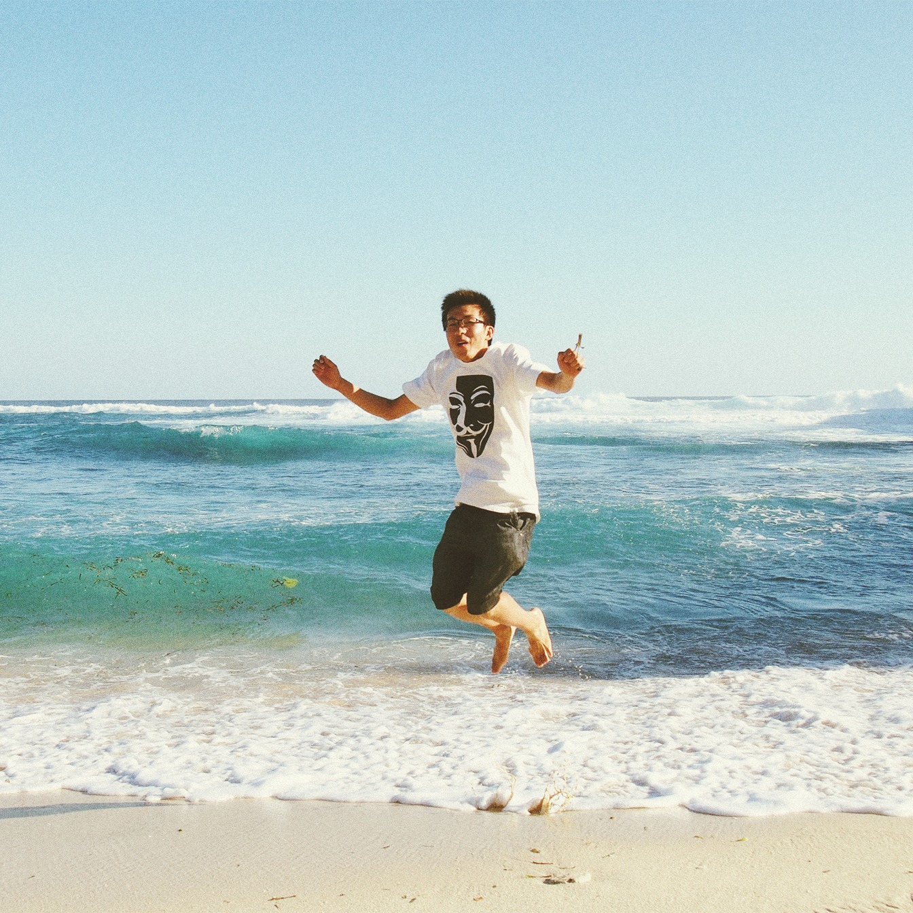

# VSCO-like Presets
This static page allows you to apply VSCO-like filters without installing anything. 

visit <a href="http://maxim-xu.github.io/vsco-like/" target="_blank">Index Page</a> 

## Fuji Provia 100F Balance Cool
&nbsp;&nbsp;
## Kodak UltraMax 400+ Green
&nbsp;&nbsp;
## Fuji Neopan 400
 &nbsp;&nbsp;
## Agfa Vista 800 Warm +
&nbsp;&nbsp;
 
Library used: <a href="http://github.com/meltingice/CamanJS" target="_blank">CamanJS</a> 
