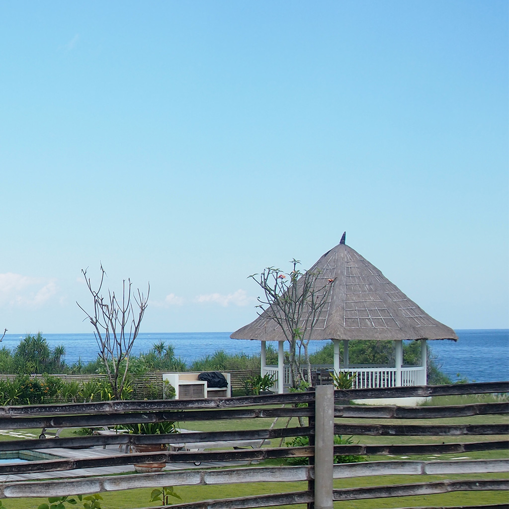

#VSCO-like Presets
This static page allows you to apply VSCO-like filters without installing anything. 

visit <a href="http://maxim-xu.github.io/vsco-like/" target="_blank">Index Page</a> 

 
 
&nbsp;&nbsp;

 
 
&nbsp;&nbsp;

 
Powered by: <a href="http://github.com/meltingice/CamanJS" target="_blank">CamanJS</a> 
